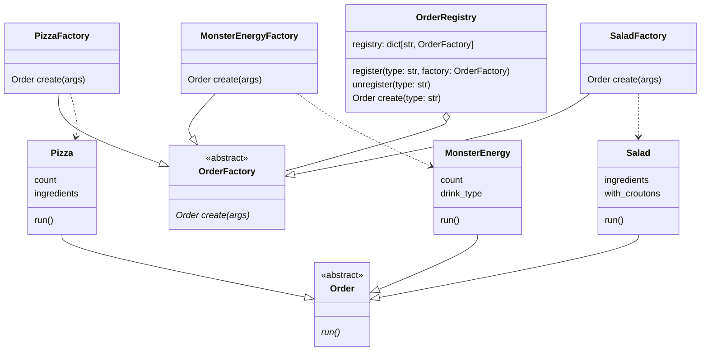

```mermaid
classDiagram

    class OrderFactory {
        <<abstract>>
        Order create(args)*
    }
    class PizzaFactory {
        Order create(args)
    }
    class MonsterEnergyFactory {
        Order create(args)
    }
    class SaladFactory {
        Order create(args)
    }
    class Order {
        <<abstract>>
        run()*
    }
    class Pizza {
        count
        ingredients
        run()
    }
    class MonsterEnergy {
        count
        drink_type
        run()
    }
    class Salad {
        ingredients
        with_croutons
        run()
    }

    class OrderRegistry {
        registry: dict[str, OrderFactory]
        register(type: str, factory: OrderFactory)
        unregister(type: str)
        Order create(type: str)
    }

    PizzaFactory --|> OrderFactory
    MonsterEnergyFactory --|> OrderFactory
    SaladFactory --|> OrderFactory
    Pizza --|> Order
    MonsterEnergy --|> Order
    Salad --|> Order

    PizzaFactory ..> Pizza
    MonsterEnergyFactory ..> MonsterEnergy
    SaladFactory ..> Salad
    OrderRegistry o-- OrderFactory
```